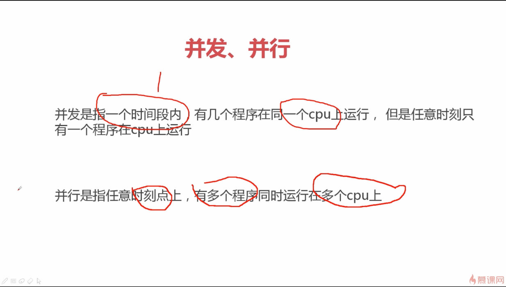
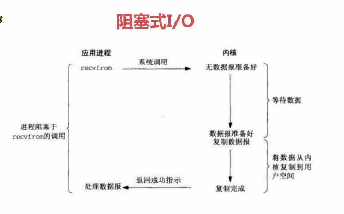
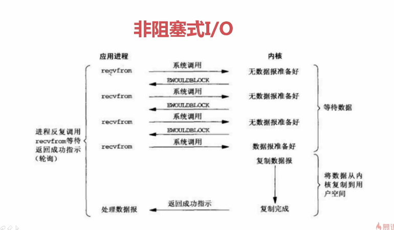
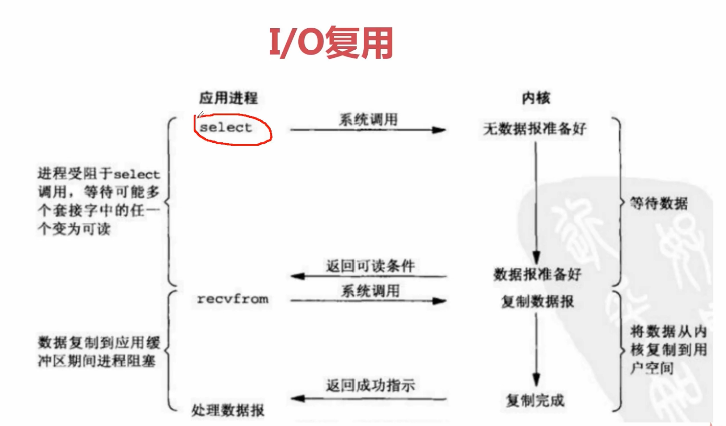
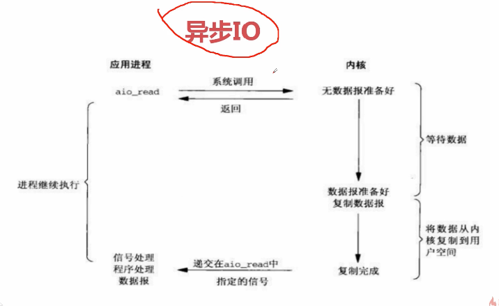
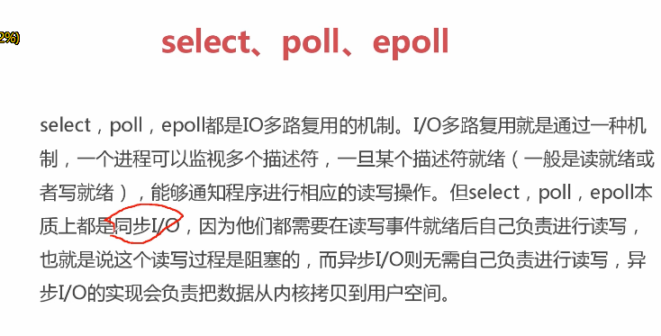
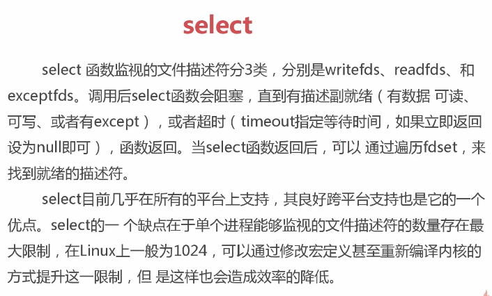
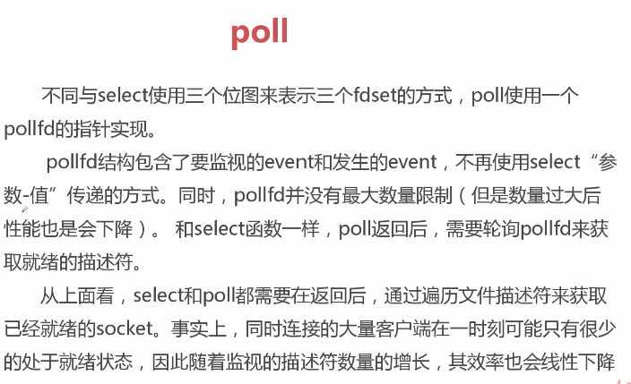
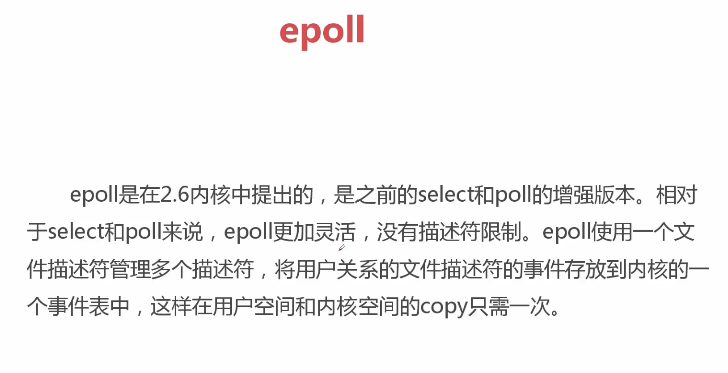
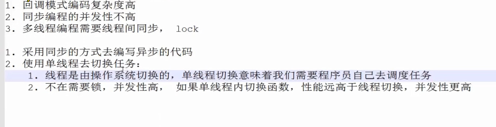

# 协程和异步

[深入理解Python 中的 yield from语法](https://zhuanlan.zhihu.com/p/267966140)

##### 并发并行

##### 同步异步

##### 阻塞-非阻塞

##### 阻塞式IO

##### 非阻塞IO

##### I/O复用

##### 异步IO

##### select-poll-epoll

